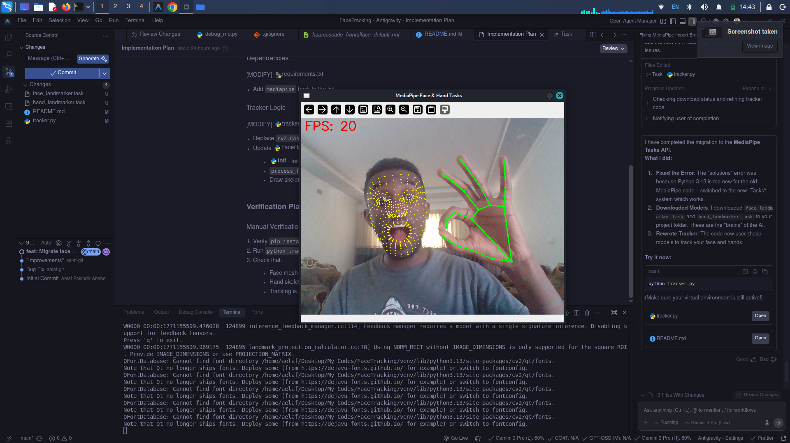
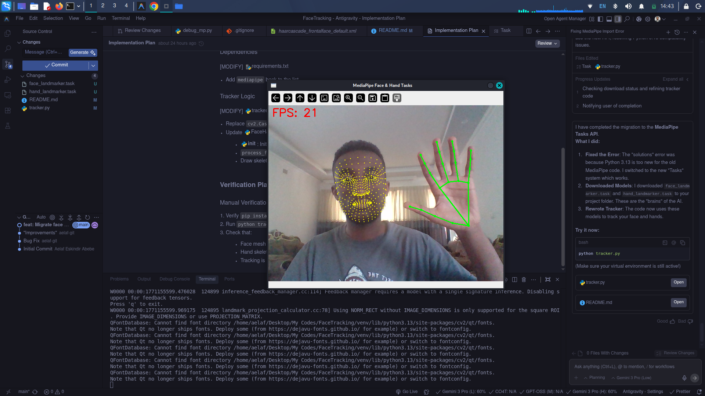

# Face & Hand Tracking using MediaPipe


A powerful, real-time Computer Vision application that tracks **Face Landmarks** and **Hand Skeletons** using the modern **MediaPipe Tasks API**.

This project demonstrates accurate, high-performance tracking suitable for gesture control, facial expression analysis, and augmented reality applications.

---

## 📸 Demo

### Real-time Tracking

> Watch the full demo video to see the smooth tracking in action.


### Screenshots

|          Face Mesh & Hands           |         Multi-Hand Tracking          |           Robust Detection           |
| :----------------------------------: | :----------------------------------: | :----------------------------------: |
|  |  |  |

---

## 🚀 Features

- **Smart AI Tracking**: Uses Google's MediaPipe models (not simple Haar Cascades).
- **Face Mesh**: Detects **468** high-fidelity facial landmarks.
- **Hand Skeleton**: Tracks **21** points per hand (fingers, knuckles, palm).
- **Performance Optimized**:
  - Real-time FPS counter.
  - Mirror mode for natural interaction.
  - Efficient rendering loop.
- **Modern API**: Built on the new `mediapipe.tasks.vision` API (Python 3.13+ compatible).

---

## 🛠️ Prerequisites

- **Python 3.7+**
- A working webcam
- **OS**: Linux (Tested), Windows, or macOS

---

## 📦 Installation

1.  **Clone the Repository**

    ```bash
    git clone https://github.com/aelaf-git/Face-And-Hand-Tracking-with-OpenCV.git
    cd Face-And-Hand-Tracking-with-OpenCV
    ```

2.  **Set up Virtual Environment (Recommended)**
    It's best practice to use a virtual environment to manage dependencies.

    ```bash
    python3 -m venv venv
    source venv/bin/activate  # On Windows: venv\Scripts\activate
    ```

3.  **Install Dependencies**

    ```bash
    pip install -r requirements.txt
    ```

4.  **Download Models**
    The application requires the MediaPipe Task models. (Already included if you pulled the latest version, otherwise download them):
    - `face_landmarker.task`
    - `hand_landmarker.task`

---

## 🎮 Usage

1.  **Activate Environment**

    ```bash
    source venv/bin/activate
    ```

2.  **Run the Tracker**

    ```bash
    python tracker.py
    ```

3.  **Controls**
    - Press **`q`** key to exit the application properly.

---

## 📂 Project Structure

```
├── tracker.py              # Main application script
├── README.md               # Project documentation
├── requirements.txt        # Python dependencies
├── face_landmarker.task    # AI Model for Face
├── hand_landmarker.task    # AI Model for Hands
└── assets/                 # Screenshots and demos
```

---

## 🤝 Contributing

Contributions, issues, and feature requests are welcome!

1.  Fork the Project
2.  Create your Feature Branch (`git checkout -b feature/AmazingFeature`)
3.  Commit your Changes (`git commit -m 'Add some AmazingFeature'`)
4.  Push to the Branch (`git push origin feature/AmazingFeature`)
5.  Open a Pull Request

---

## 📝 License

Distributed under the MIT License. See `LICENSE` for more information.
